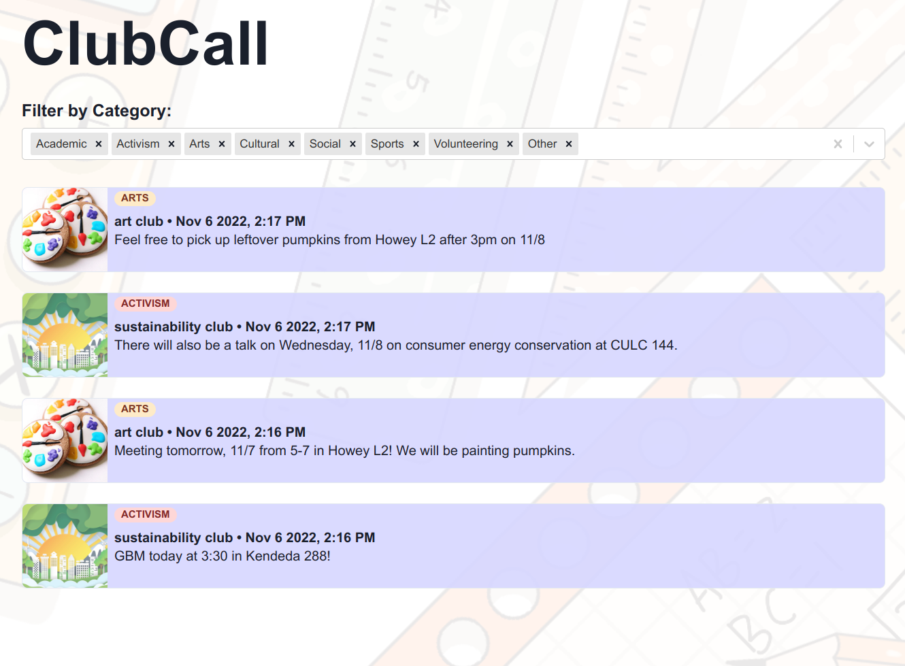

# CLUBCALL

#Inspiration
Discord is know for its ability to gather people with similar interests in chat servers. This has led to many clubs turning to Discord to communicate with members, rather than using antiquated methods like mailing lists or Google Groups. However, when announcements are sent out, they show up in different servers and it is hard to keep track of what announcements are made from which club. Furthermore, students who aren't currently in the Discord server but want to join the club might have a hard time doing so since club webpage information is often outdated. Thus, we created ClubCall.

#What it does
ClubCall is a service that is both a Discord bot and a web frontend. When the Discord bot is initially added to a Discord server, the bot communicates privately with the server owner to "register" the club, meaning confirm that announcements from the server should be saved, and confirm the type of the club (academic, sports, arts, etc.) The Discord bot then listens for announcements made in servers and aggregates all announcements in a database, and the web frontend allows the user to view all announcements at once, as well as filter based on club type.

#How we built it
The Discord bot is written in Python, and we build it using the Discord.py bot framework. When the bot is added to a server, it sends a DM to the owner and lets the owner react with a specific emoji to choose the type of the club, which required a bit of asyncio work. It saves this information to its Firestore database.

When an announcement is made, the bot writes the announcement to a collection in its Firestore database, and the time of the announcement is saved. We Dockerized the bot, and it is deployed as a docker-compose service on a DigitalOcean server.

The frontend was made with React.js and the ChakraUI component library. The page uses react-router-dom to route the splash and dashboard pages. It reads data from the Firestore database ordered by the announcement timestamp, and allows people to filter the type of clubs they want to see announcements from using a multi-selector search component. It is continuously built and deployed on Netlify.

